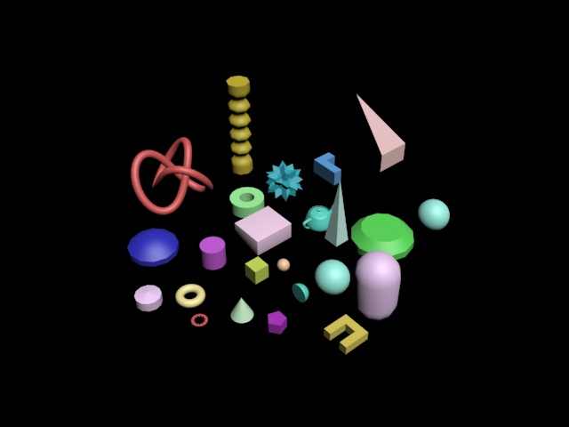
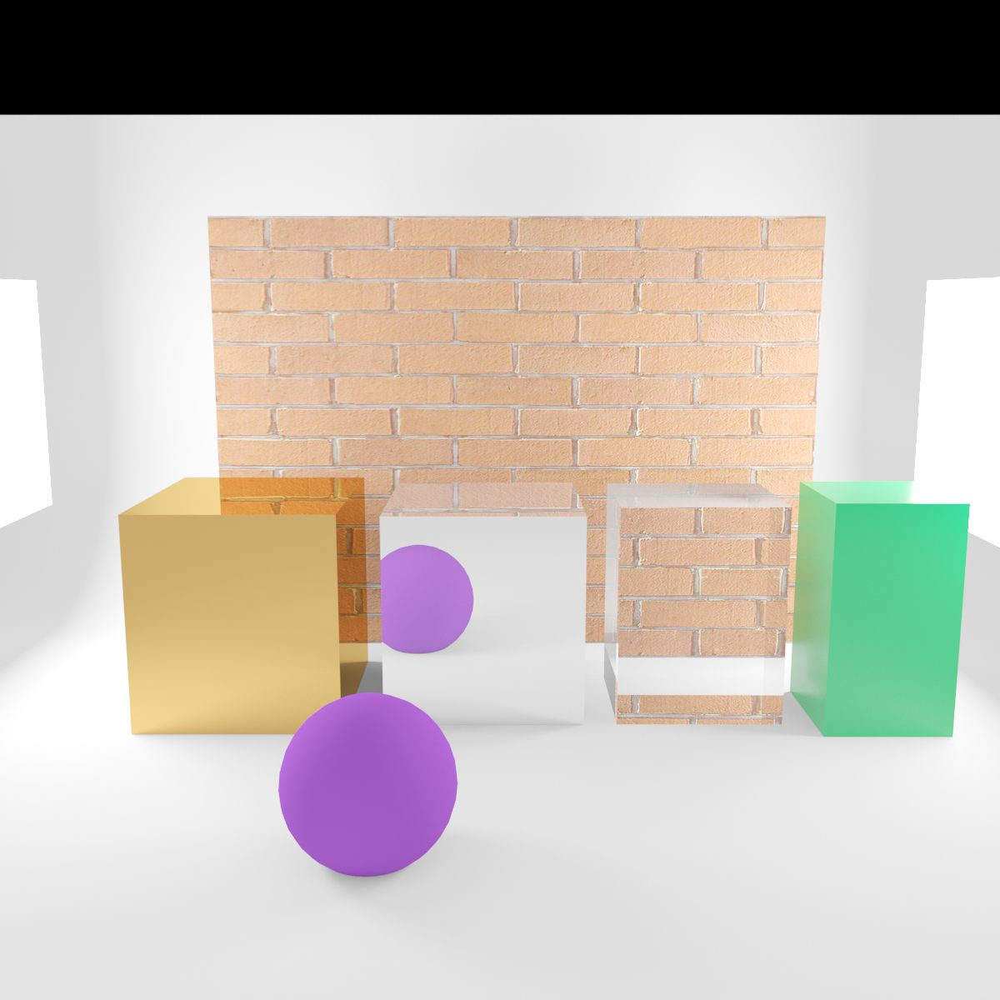

# 3DS MAX

## _Первые шаги изучения_

Как и у большинства, изучение 3ds max началось с изучения простых форм

И первая попытка сделать что-то из простых форм

Далее начались более сложные формы, создание которых требовало вызова тех или иных операций (например, отзеркаливание или вращение вокруг оси)

И вот наконец мне надоело делать простые фигуры и настало время придумать сцену для реализации которой мне потребуется максимально изучить программу

Собравший с мыслями я выдавил из себя эскиз, который в последствии должен был превратиться в шедевр

На данном этапе стало ясно, что мне необходимо заняться материалами

Сначала я копанул в сторону стандартных материалов и их настроек

Затем познакомился с развёрткой

Пришло время применить материалы к эскизу

Уже стало что-то получаться, но необходимо заняться светом

Была найдена готовая сцена с комнотой и началось обучения работы с разными источниками света

Настало время дополнить эскиз источниками света

В целом я уже был доволен проделанной работой, но было очевидно, что летающий телевизор и пустая комната - не самый лучший результат для демонстрации усвоенного материала

Тогда я познакомился с физикой, созданием частиц и ещё чутка углубился в материалы

В результате я получил свой первый завершённый рендер

Оставалось поиграться с камерой и настройками рендера

И вот моя первая работа закончена (не без недостатков, но я доволен)

