# Blender

## _Первые шаги изучения_

На момент знакомства с ПО Blender я уже имел познания в 3ds max, ZBrush и другими ПО работы с 3д графикой.

В связи с этим в моей голове промелькнула мысль: "А не попробовать ли сразу же что-то посильнее, а не изучать простые фигуры и действия"

Так по гайдам из интернета на свет появились: грибочек, пчела и мини пляж

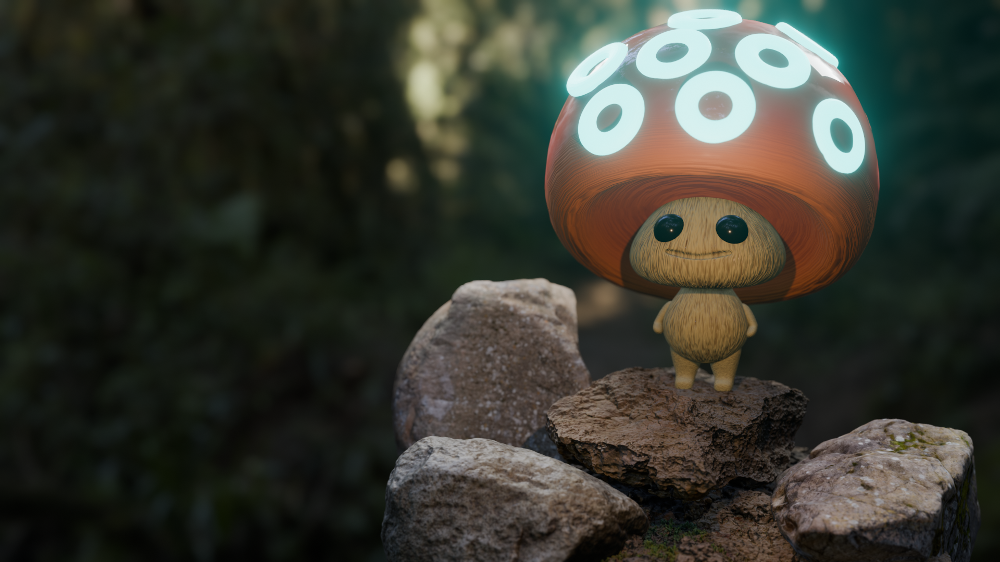
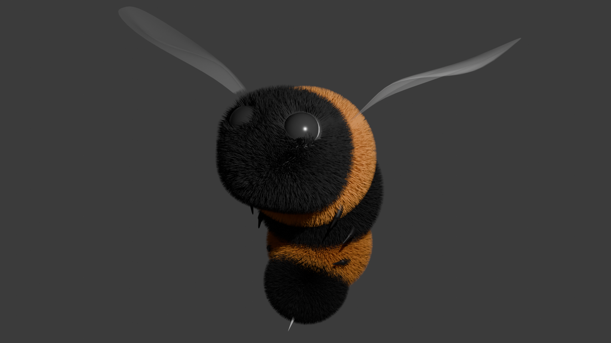
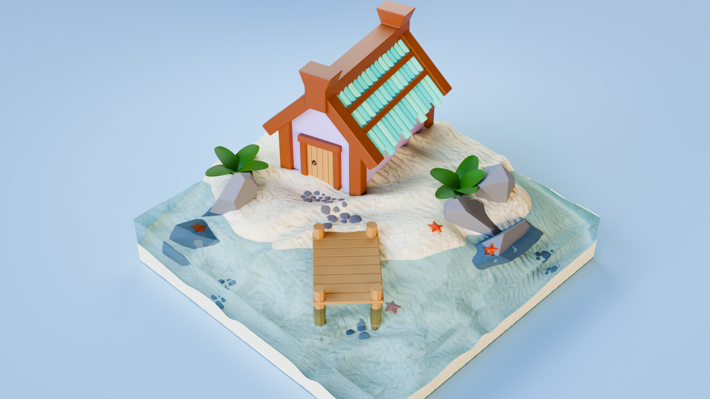

Я понял то, на сколько мощный Blender

В нём можно создавать всё и сразу же, а главное не нужно переключаться между ПО, чтобы сделать развёртку или текстуру - всё можно настроить непосредственно в блендере

Тогда я решил попробовать сделать что-то сам: выходило не самым лучшим образом, я представлял, что это можно сделать, но к сожалению не имел представление как это сделать, куда нажать, куда посмотреть - мне не хватало фундаментальных знаний

И тут я принял решение - всё таки пройти некое обучение и оно началось:

Для начала был реализован Бургер, который показал, что я могу сделать простые фигуры, передвигать их по сцене и в целом имею представление о Blender

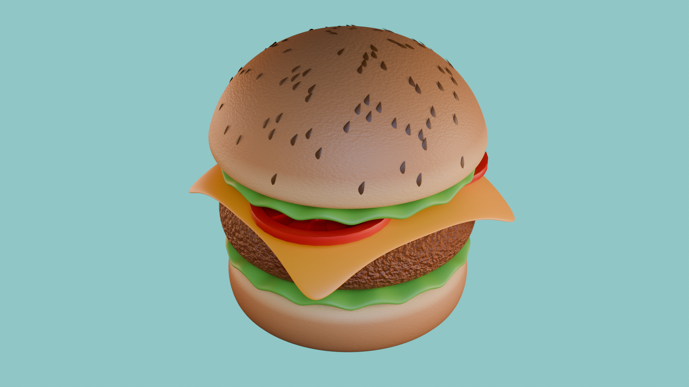

Тогда появилось желание поработать не столько с формой, сколько с текстурой и освещением:

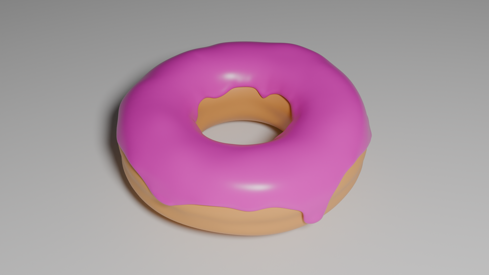
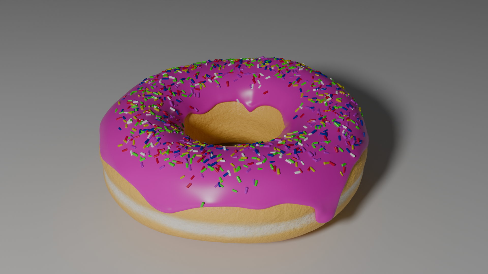
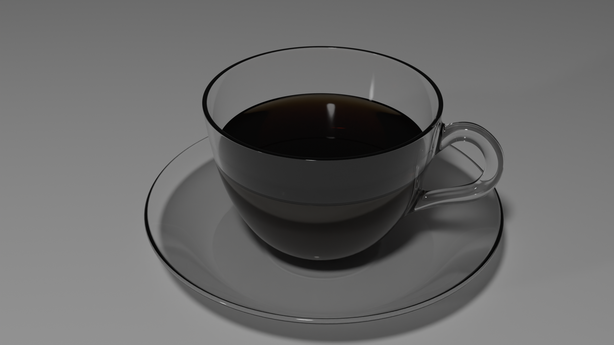
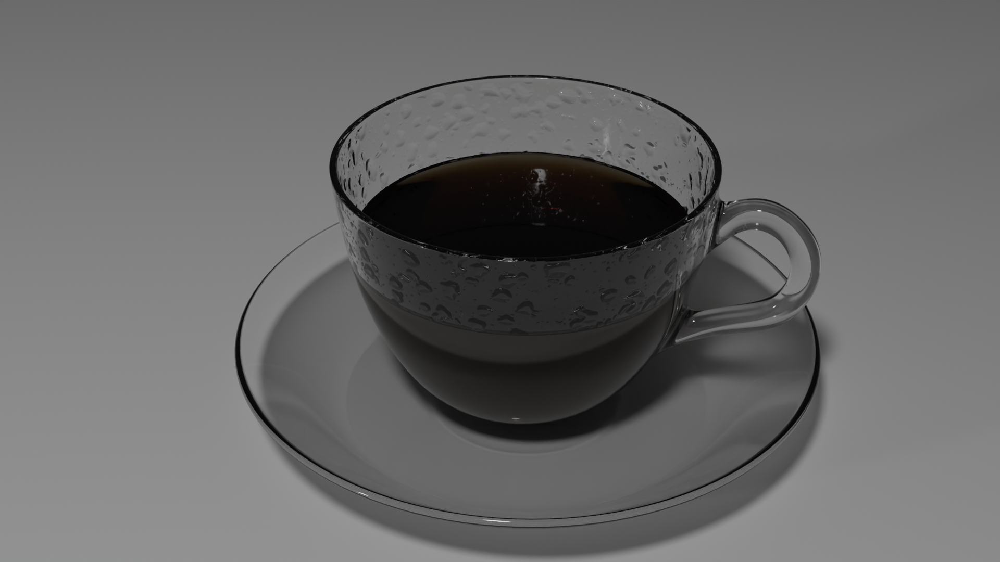
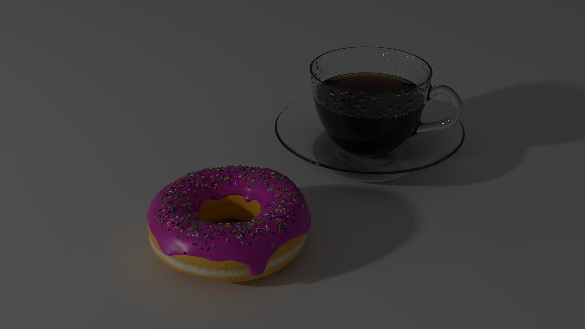
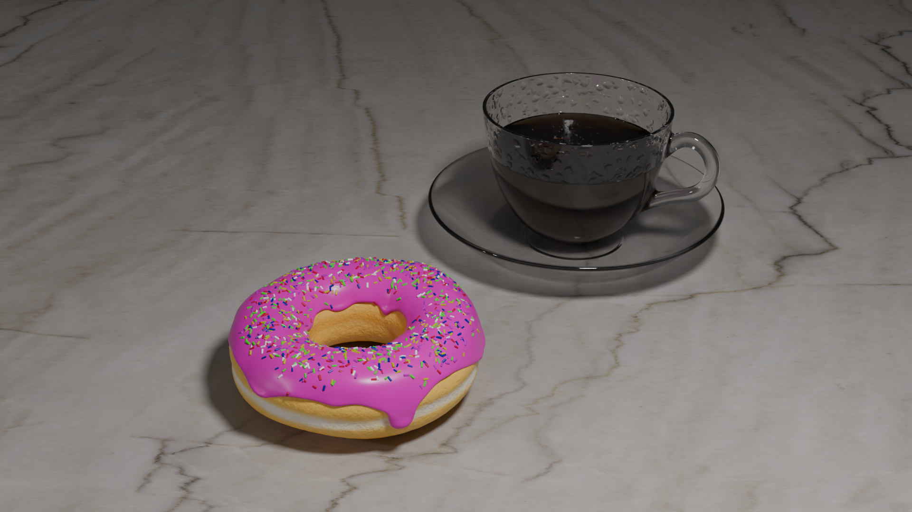
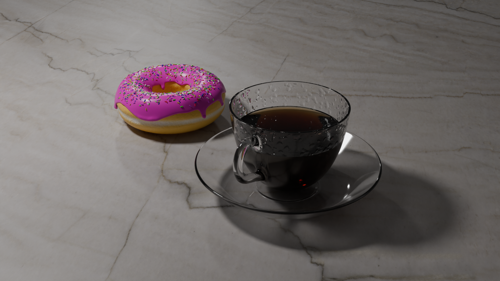

В результате поработал с текстурами, освещением, камерой (в конце реализовано вращение)

Очень сильно загорелся блендером, но к сожалению возникла не хватка времени