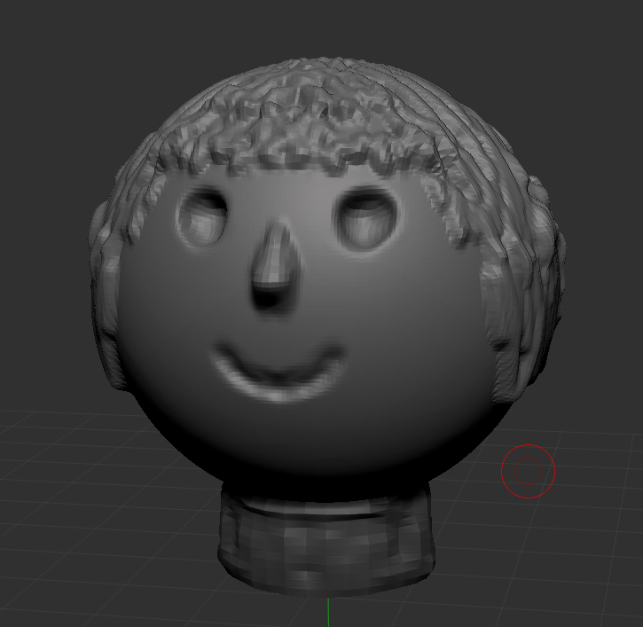
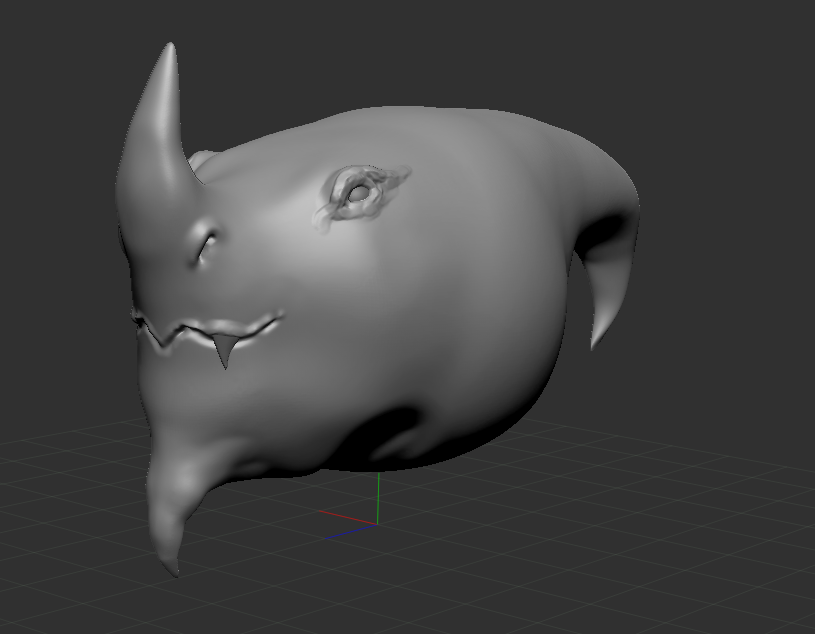
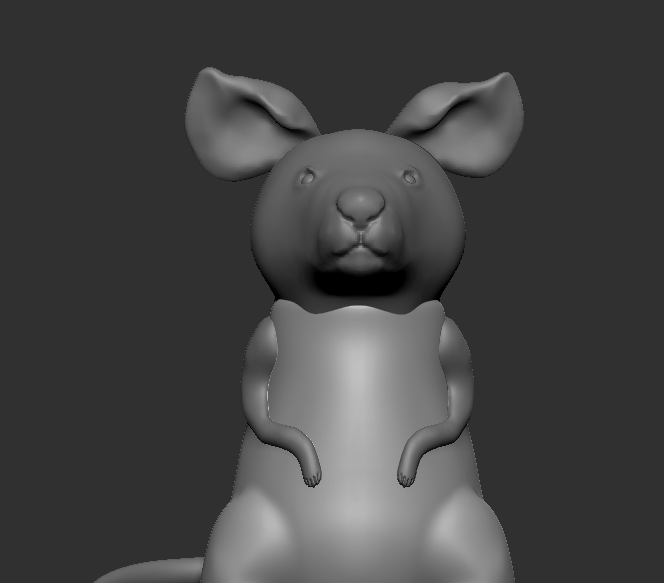
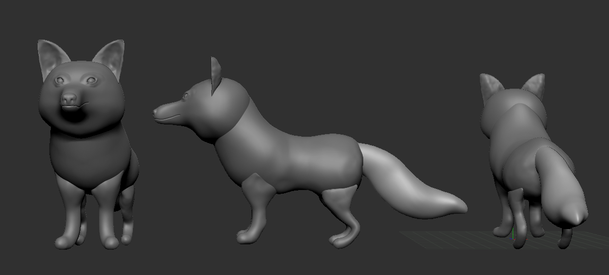
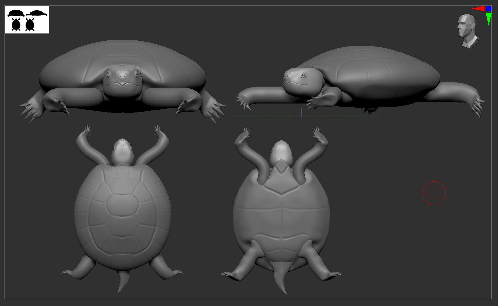

# ZBrush

## _Первые шаги изучения_

Мои вторым экспериментом в 3Д стало ПО ZBrush - это произошло после того как у меня появилась графический планшет XP-Pen Deco V2

Увы, как оказалось, скульптинг - это не моё

Хотя признаюсь, что мне нравится конечная работа - черепашка. Хоть и понимаю, что она далека от завершения

